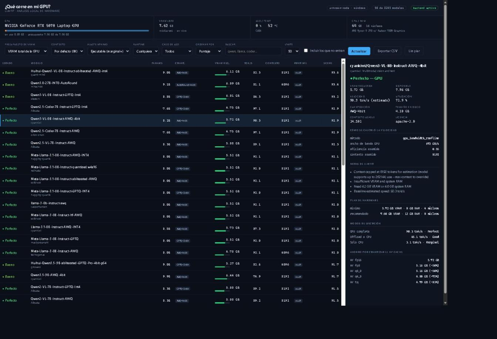
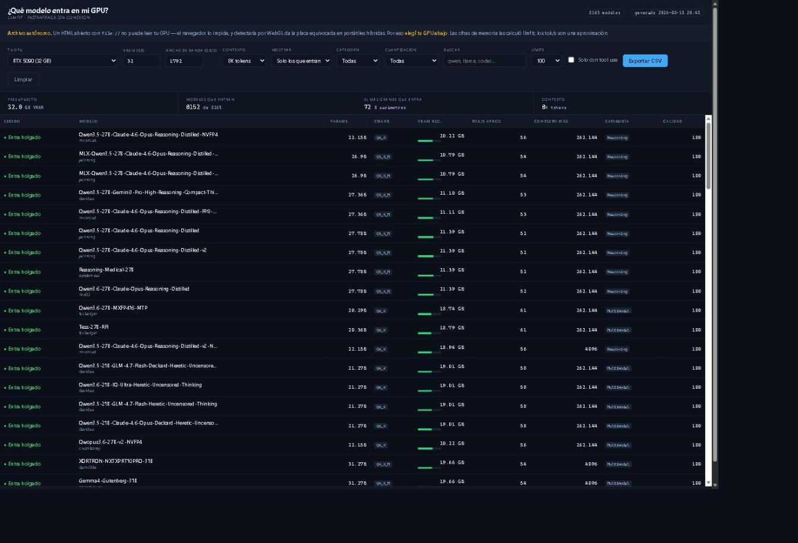

# LLM Fit GUI

**¿Qué modelos LLM puedo correr en la GPU de esta máquina?** Una GUI local que
responde esa pregunta, en español, con la VRAM que tenés libre **ahora mismo**.

```bash
uv run https://raw.githubusercontent.com/matiasagustincastro-byte/llmfit-gui/main/llmfit-gui.py
```

Eso es todo. Un comando, igual en Linux y en Windows. Sin clonar, sin instalar,
sin configurar.



---

## Créditos

Este proyecto **no es un motor de estimación**: es una interfaz construida sobre
**[llmfit](https://github.com/AlexsJones/llmfit)**, de
**[Alex Jones](https://github.com/AlexsJones)** (licencia MIT).

Todo el trabajo pesado es de llmfit: la detección de hardware, el catálogo de
~8.200 modelos, y el modelo de estimación de memoria y velocidad. Acá se usa su
**API REST** (`llmfit serve`) y se le agrega una capa encima.

Si esto te sirve, andá a **[darle una estrella al repo original](https://github.com/AlexsJones/llmfit)** —
es donde está el mérito.

> llmfit también trae su propio dashboard web, TUI y app de escritorio.
> Si no necesitás lo que agrega este proyecto, `llmfit serve` sola ya te da
> una interfaz muy completa.

### Qué agrega esta GUI

1. **VRAM libre real, en vivo.** La API de llmfit devuelve `gpu_available_gb: null`
   — sabe cuánta VRAM *tenés*, no cuánta te *queda*. Acá se lee `nvidia-smi`
   cada 3 s y podés usar esa cifra como presupuesto, así el ranking refleja lo
   que hay libre **con el navegador y todo lo demás abierto**.
2. **Semáforo por modelo**: Perfecto / Bueno / Justo / CPU offload / No entra,
   con barra de ocupación contra tu presupuesto.
3. **Plan de hardware por modelo**: mínimo vs recomendado, los tres modos de
   ejecución (GPU / offload / solo CPU) con su tok/s, y cuánta VRAM ahorrás
   cuantizando el KV cache (fp8, q8_0, q4_0).
4. **Exportar a CSV** lo que estés viendo, respetando los filtros.
5. **Simular otra placa**: catálogo de 247 GPUs — toda la línea NVIDIA
   (GeForce RTX 50/40/30/20, GTX 16/10/900, RTX PRO y RTX/Quadro de estación de
   trabajo, centro de datos B300/B200/GB200/H200/H100/A100/L40S/V100/T4, Jetson),
   más AMD, Intel Arc, Apple Silicon y solo-CPU. Sirve para responder «¿y si
   tuviera una H200?» antes de comprarla.
6. **Versión sin conexión**: un HTML de 1,4 MB que anda con doble clic.
7. Interfaz en español, sin build ni dependencias JS.

---

## Las dos versiones

| | App con servidor | Archivo único HTML |
|---|---|---|
| Arranque | `uv run llmfit-gui.py` | doble clic |
| Hace falta instalar | uv (o Python + llmfit) | **nada** |
| VRAM libre real, en vivo | ✅ vía `nvidia-smi` | ❌ elegís tu GPU de una lista |
| Detecta tu hardware | ✅ | ❌ ([por qué](#por-qué-el-html-no-puede-detectar-tu-gpu)) |
| Catálogo | en vivo, siempre al día | instantánea congelada |
| Plan de hardware, KV cache | ✅ | ❌ |
| Necesita internet | solo la 1ª vez | nunca |



---

## Instalación

### Lo más simple: nada

```bash
uv run https://raw.githubusercontent.com/matiasagustincastro-byte/llmfit-gui/main/llmfit-gui.py
```

`uv` descarga el script, resuelve el intérprete de Python **y** el wheel de
`llmfit` para tu plataforma, y arranca. No instala nada en el sistema.

### Si no tenés uv

```bash
curl -LsSf https://astral.sh/uv/install.sh | sh              # Linux / macOS
powershell -c "irm https://astral.sh/uv/install.ps1 | iex"   # Windows
```

### Clonando el repo

```bash
git clone https://github.com/matiasagustincastro-byte/llmfit-gui
cd llmfit-gui
uv run llmfit-gui.py
```

En Linux y macOS también corre directo, por el shebang de uv:

```bash
chmod +x llmfit-gui.py && ./llmfit-gui.py
```

### Sin uv

Con `llmfit` ya instalado y en el PATH alcanza con `python llmfit-gui.py`: el
servidor no usa nada fuera de la stdlib.

```bash
uv tool install -U llmfit     # o: pipx install llmfit
```

### Opciones

```
--port N            puerto de la GUI (8080)
--llmfit-port N     puerto del backend llmfit (8787)
--no-browser        no abrir el navegador
--app-window        abrir sin barra de direcciones, como app de escritorio
```

---

## Acceso directo en Windows

```powershell
powershell -ExecutionPolicy Bypass -File instalar-acceso-directo.ps1
```

Crea **LLM Fit** en el escritorio y en el menú Inicio (anclable a la barra de
tareas). Doble clic y la app abre en su propia ventana, sin barra de direcciones.
La consola queda minimizada; cerrarla apaga también el backend.

No instala nada ni toca el registro: solo crea dos `.lnk`. Se revierte con
`-Desinstalar`.

El navegador lo abre `server.py` **cuando el servidor ya está escuchando**, no el
lanzador, para que nunca aparezca un «no se puede conectar».

---

## Requisitos

| Componente | Para qué | Si falta |
|---|---|---|
| `uv` | resuelve Python + llmfit solo | usá `python` + `llmfit` a mano |
| Python 3.8+ | el servidor local (solo stdlib) | lo instala uv |
| `llmfit` | catálogo + motor de estimación | lo instala uv |
| telemetría de GPU | VRAM libre en vivo | **opcional**, ver abajo |

### Plataformas

`llmfit` publica wheels precompilados para toda esta matriz, así que `uv run`
funciona igual en todas:

| Plataforma | Arquitecturas |
|---|---|
| Windows | x64 · **ARM64** |
| Linux (glibc) | x64 · **ARM64** |
| Linux (musl / Alpine) | x64 · **ARM64** |
| macOS | Intel · **Apple Silicon** |
| Linux | riscv64 |

### Telemetría de GPU

Se prueban en orden; gana el primero que responda. Ninguno es obligatorio: sin
telemetría la app funciona igual con la VRAM total que reporta llmfit, solo
perdés el modo «VRAM libre ahora».

| Detector | Cubre | Da |
|---|---|---|
| `nvidia-smi` | NVIDIA en Windows y Linux, x64 y ARM | libre / usada / uso % / temp |
| `rocm-smi` | AMD ROCm (Linux) | libre / usada / uso % / temp |
| `sysctl` + `vm_stat` | Apple Silicon (memoria unificada) | libre / usada |

---

## Exportar a CSV

El botón **Exportar CSV** está en las dos versiones y exporta **las filas que
coinciden con los filtros activos**, no el catálogo entero.

- Formato RFC 4180 (coma, comillas dobles duplicadas), decimales con punto.
- Lleva BOM UTF-8, así Excel respeta los acentos sin preguntar nada.
  pandas (`encoding="utf-8-sig"`) y Google Sheets lo ignoran.
- El nombre describe el escenario:
  `llmfit_NVIDIA-GeForce-RTX-5070-Laptop-GPU_8.0GB_auto_2026-08-18.csv`
- 23 columnas en la app con servidor (tok/s medidos vs estimados, contexto
  usable, score y sus componentes); 18 en la versión de archivo único.

---

## La versión sin conexión

```bash
uv run build_standalone.py      # genera llmfit-standalone.html (~1,4 MB)
```

Se abre con doble clic en cualquier máquina: sin Python, sin llmfit, sin
conexión. Cero referencias externas.

### Por qué el HTML no puede detectar tu GPU

No es una decisión de diseño, son tres paredes reales:

1. Un HTML en `file://` **no puede ejecutar procesos**. No hay `nvidia-smi` ni
   `llmfit`. El sandbox del navegador lo impide.
2. Tampoco puede consultar a `llmfit serve`: **no manda cabeceras CORS**, así
   que el navegador bloquea la respuesta desde `file://`.
3. Detectar la GPU por WebGL **da la placa equivocada**. En la portátil donde se
   desarrolló esto, WebGL reporta `AMD Radeon 780M` — la integrada — y no la
   RTX 5070 que realmente hace la inferencia. En portátiles híbridas (la
   mayoría) daría respuestas incorrectas con apariencia de certeza.
   `navigator.deviceMemory` además viene capado por antifingerprinting (dice
   32 GB en una máquina de 64 GB) y `adapter.info` de WebGPU viene vacío.

Por eso elegís la GPU de una lista de 247 placas (`gpus.py`) con su VRAM y
ancho de banda, o cargás los valores a mano.

### Qué precomputa y qué aproxima

El generador consulta a llmfit **una vez por nivel de contexto** (2K a 128K) y
congela sus resultados. **No se reimplementa su motor** — se intentó y se
descartó: la fórmula de velocidad tiene 6,2 % de error mediano pero **32 % en el
percentil 95**, y los umbrales de fit se solapan (los «Perfect» van de 6 % a
100 % de utilización).

- **Memoria requerida: exacta.** Sale de llmfit. Verificado contra la API en
  vivo: Qwen2.5-Coder-7B-GPTQ-Int4 da 4,75 GB a 8K y 6,06 GB a 32K en ambas
  versiones.
- **Calidad: exacta.** Es el componente `quality` del score, que no depende de
  la VRAM y por eso vale con cualquier GPU que elijas.
- **tok/s: aproximado.** Se calcula en el navegador con
  `ancho_de_banda × 0,55 ÷ peso_en_disco`. Va etiquetado como aproximado.

Se descartan 91 modelos (1,1 %) a los que llmfit no les pudo determinar el
tamaño y les asigna 0,5 GB de relleno: embeberlos daría un «entra holgado» falso.

---

## Equipos sin internet

| Situación del destino | Qué le llevás | Cómo se ejecuta |
|---|---|---|
| **Internet + uv** (lo normal) | nada | `uv run <url>` |
| Internet, sin permisos | `LLM-Fit-offline.zip` (5,2 MB) | `python server.py` |
| **Sin internet** | `LLM-Fit-offline.zip` | `python server.py` |
| Sin Python ni permisos | `llmfit-standalone.html` (1,4 MB) | doble clic |

```bash
python preparar-bundle.py                          # solo fuentes, 30 KB
python preparar-bundle.py --plataformas win_amd64  # + binario, 5,2 MB
python preparar-bundle.py --todas --standalone     # todo, para repartir
python preparar-bundle.py --listar                 # ver plataformas
```

Con `--plataformas` baja el binario de llmfit desde PyPI y lo deja en
`bin/<sistema>-<arquitectura>/`. `server.py` busca ahí **antes** que en el PATH,
así que el destino no necesita internet ni uv: solo Python 3.8+. Podés
vendorizar varias plataformas en el mismo ZIP y usar el mismo paquete para
Windows, Linux y macOS.

---

## Arquitectura

```
navegador  ──►  server.py (:8080)  ──►  llmfit serve (:8787)
                     │
                     └──►  nvidia-smi / rocm-smi / sysctl
```

`server.py` proxea para evitar CORS y servir todo desde un mismo origen.

| Ruta | Qué devuelve |
|---|---|
| `GET /api/gpu` | telemetría en vivo por GPU (cacheada 2 s), con el ancho de banda que le pone `gpus.py` |
| `GET /api/gpu-catalog` | el catálogo de placas para el selector «simular otra placa» |
| `GET /api/status` | si el backend llmfit responde |
| `GET /llmfit/*` | proxy a la API de llmfit |
| `POST /llmfit/*` | idem, para `/api/v1/plan` |

### API de llmfit que se usa

- `GET /api/v1/system` — hardware detectado
- `GET /api/v1/models` — filtros: `limit`, `min_fit`, `sort`, `use_case`,
  `runtime`, `provider`, `search`, `vram_gb`, `ram_gb`, `cpu_cores`,
  `max_context`, `perfect`, `include_too_tight`
- `POST /api/v1/plan` — body `{model, context}`;
  **`context` es obligatorio** (sin él responde 422)

`vram_gb` es la clave: llmfit **re-puntúa todo el catálogo del lado del
servidor** con ese presupuesto, así que el selector de VRAM no filtra en el
cliente sino que cambia el cálculo entero.

---

## Archivos

```
llmfit-gui.py                LA APP EN UN ARCHIVO (generado, se versiona)

server.py                    servidor local + telemetría GPU + proxy
                             (cabecera PEP 723: declara llmfit para `uv run`)
web/index.html               la GUI (HTML + CSS + JS, sin dependencias)
gpus.py                      catálogo de placas: VRAM y ancho de banda
                             (lo comparten la app con servidor y el HTML)
run.sh                       lanzador Linux / macOS
LLM-Fit.bat                  lanzador Windows
instalar-acceso-directo.ps1  crea los .lnk de escritorio y menú Inicio

build_standalone.py          generador de la versión sin conexión
web/standalone.tpl.html      su template

preparar-bundle.py           arma los ZIP y el archivo único

CHANGELOG.md                 qué cambió en cada versión
```

`llmfit-gui.py` se genera a partir de `server.py` + `web/index.html` +
`gpus.py`. Si tocás alguno de los tres:

```bash
python preparar-bundle.py --unico
```

Para desarrollar conviene `uv run server.py`, que no hay que regenerar.

---

## Notas

- Los tok/s son **estimaciones** del modelo de roofline de llmfit, no
  benchmarks. Los medidos aparecen con `*`. Para medir de verdad: `llmfit bench`.
- El catálogo de modelos se actualiza con `llmfit update`. El de placas es
  `gpus.py`: agregar una es una línea `("Nombre (N GB)", vram_gb, ancho_gbps)`.
  Las cifras son las nominales del fabricante; lo que manda la velocidad es el
  ancho de banda, no los TFLOPS.
- Todo corre en `127.0.0.1`. llmfit no hace tráfico de red salvo que se lo pidas
  explícitamente (descargas, leaderboard).

## Licencia

MIT — ver [LICENSE](LICENSE).

`llmfit`, el proyecto sobre el que se apoya, es MIT de
[Alex Jones](https://github.com/AlexsJones) y se distribuye por separado.
Este repo no incluye su código fuente: lo consume como dependencia desde PyPI.
